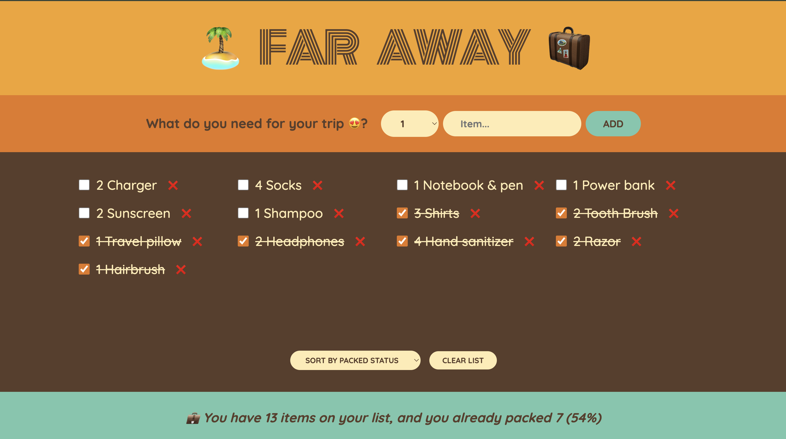

# ✈️ Travel Packing List App

This is a simple React app to help you track what to pack and what’s already packed for your trips. You can add, delete, toggle items as packed/unpacked, and even clear the entire list.


## 📷 Preview


## ⚙️ Features

- Add travel items with quantity
- Mark items as packed/unpacked
- Remove individual items
- Clear the full list
- View simple packing stats

## 🧠 Concepts Practiced

- Lifting state up
- Derived state for statistics
- Passing callback functions via props
- useState hook for complex state management
- Conditional rendering and mapping over lists

## 🚀 Getting Started

Clone the repo:

```bash
git clone https://github.com/mfa1zan/travel-list-app.git
cd travel-list-app
```

Install dependencies:

```bash
npm install
```

Start the development server:

```bash
npm start
```


